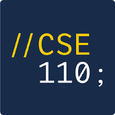

# Heading 1 {#section}
## Heading 2
### Heading 3

*Italic*

**Bold**

***Bold and Italic***

~~Strikethrough~~

> quoted text

`quoted code`

[External](https://www.linkedin.com/in/-justin-yang/)

[Section](#section)

[Relative - README](README.md)

1. Order 1
2. Order 2

- Unorder 1
- Unorder 2

- [x] Task 1
- [ ] Task 2
